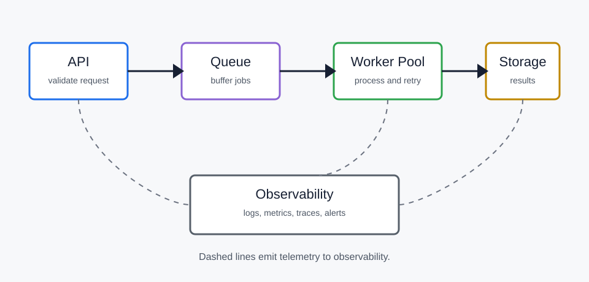

# Architecture

このページは、画像、表、長い見出し、ページ内リンクの確認用です。

## System Diagram

以下の画像をクリックすると、LightBox addon が有効な場合は拡大表示できます。

## Worker Pool

`batch-services` は worker pool でキューを処理する想定のサンプルです。

| Layer   | Responsibility       | Scaling signal |
| ------- | -------------------- | -------------- |
| API     | ジョブ登録と入力検証 | Request rate   |
| Queue   | 非同期処理の平準化   | Queue depth    |
| Worker  | 実処理とリトライ     | CPU, backlog   |
| Storage | 実行結果と監査ログ   | Write latency  |

## Data Flow

1. API が request を検証します。
2. API が `idempotency key` とジョブ payload を保存します。
3. Queue にジョブ ID を投入します。
4. Worker がジョブ ID を取り出し、Storage から payload を読みます。
5. Worker が結果を書き戻し、監査ログを出力します。

## Anchors

この長い見出しは、右側のページ内目次と permalink の見え方を確認するためのサンプルです。

### Worker Pool Scaling Thresholds and Backpressure Behavior

| Metric               | Warning | Critical |
| -------------------- | ------: | -------: |
| Queue depth          |   1,000 |    5,000 |
| Oldest message age   |  10 min |   30 min |
| Worker restart count |  3/hour |  10/hour |

!!! note "Architecture decision"
Worker の水平スケールは queue depth を主信号にし、downstream の rate limit を超えないように上限を持たせます。
